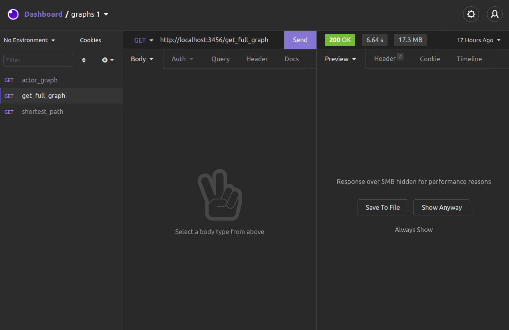
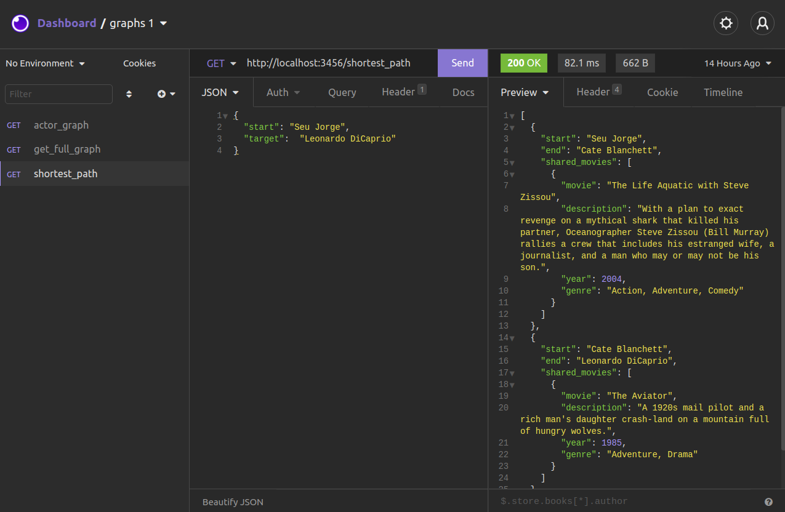

# Grafos1_IMDBConnection

Explicação: https://youtu.be/PUTXrwauBLQ
Download: https://drive.google.com/file/d/13Gn2xQT8l6DKcz4XF4vBN-o4Du3jqyCN/view?usp=sharing

Temas:
 - Grafos1

# 🕸️ IMDBConnection
  
**Número da Lista**: 14 
**Conteúdo da Disciplina**: BFS  

## Alunos
|Matrícula | Aluno |
| -- | -- |
| 16/0119553  |  👨‍💻 Felipe Campos de Almeida |
| 16/0005736  |  👩‍💻 Fabiana Luiza Vasconcelos Pfeilsticker Ribas |

## ℹ️ Sobre 
O IMDBConnection utiliza um Internet Movie Database ou IMDb que é uma base de dados online de informação sobre cinema TV, música e games, hoje pertencente à Amazon, para aplicar a teoria de Kevin Bacon 🥓 de que todas as pessoas do mundo estão separadas por no máximo seis graus de distância. No nossso projeto, limitamos a base para atores e atrizes e os filmes correlacionados. Nosso trabalho propoem encontrar o vínculo mais curto entre o ator ou atriz de interesse e qualquer ator ou atriz alvo.

## 📷 Screenshots 

1) Visualize o Grafo completo:

2) Pesquise sobre um ator ou atriz:

3) Visualize o menor caminho entre os atores ou atrizes:

## ⚙️ Instalação 
**Linguagem**: 🐍 Python 
**Framework**: 🌶️ Flask e 💜 Insomnia 

### Para distribuição Linux 🐧 :

**Para a execução do projeto é necessário a instalação previa do docker e docker-compose.**

1) [Clone](https://help.github.com/en/articles/cloning-a-repository) o repositório do projeto. Para clonar vá ao terminal e digite:
~~~
$ git clone https://github.com/projeto-de-algoritmos/Grafos1_IMDBConnection.git
~~~

2) Entre na pasta do projeto:
~~~
$ cd Grafos1_IMDBConnection
~~~

3) Para compilar o projeto, entre a pasta /api e execute o comando do docker:
~~~
$ cd api
$ docker-compose up --build
~~~

4) Depois de realizar todos esses passos, aproveite o projeto e divirta-se!

## 💻 Uso 
Utilize o isominia para as requisições http. Siga os exemplos a baixo pra utilizar as rotas. Escolha o seu artista favorito para testar a aplicação.😉

1) Visualize o Grafo completo em:http://localhost:3456/get_full_graph

2) Pesquise sobre um ator ou atriz enviado o payload a baixo para: http://localhost:3456/actor_graph
~~~
{
    "actor": "Lara Grice"
}
~~~

3) Visualize o menor caminho entre os atores ou atrizes enviado o payload a baixo para: http://localhost:3456/shortest_path
~~~
{ 
    "start": "Seu Jorge",
    "target":  "Leonardo DiCaprio"
}
~~~

## Outros 
Quaisquer outras informações sobre seu projeto podem ser descritas abaixo.
